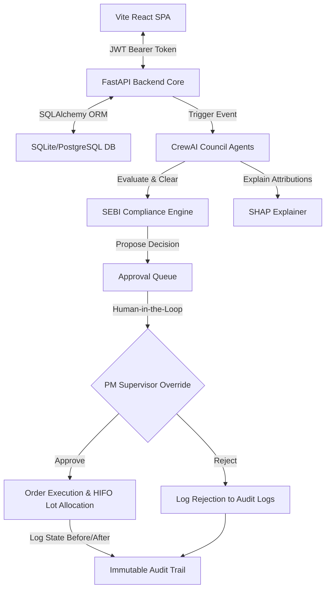

# 🛡️ WealthPilot AI - Autonomous Portfolio Sentinel
[](https://fastapi.tiangolo.com/)
[](https://react.dev/)
[](https://tailwindcss.com/)
[](https://www.postgresql.org/)
[](https://github.com/joaomgmd/crewai)
[](https://www.docker.com/)
[](LICENSE)

An enterprise-grade **Autonomous Portfolio Rebalancing System** featuring daily drift monitoring, a multi-agent decision council, pre-trade compliance checks, HIFO tax-loss harvesting, Explainable AI (XAI) reports, and a human-in-the-loop control center.

---

## 📈 Quantitative Backtest Results (2023 - 2026)

Sentinel was tested over a **3.42-year daily simulation** (Jan 1, 2023 to June 1, 2026) starting with a principal of **$1,000,000.00** on a Balanced risk profile. The historical timeline includes a simulated **35% market correction** and subsequent recovery to evaluate tax-harvesting performance.

| Metric | AI Autonomous (HIFO) | Legacy Quarterly (FIFO) | Static Buy & Hold |
| :--- | :---: | :---: | :---: |
| **Final Portfolio Value** | **$1,481,793.08** | $1,468,541.05 | $1,581,566.25 |
| **CAGR (%)** | **12.21%** | 11.92% | 14.38% |
| **Sharpe Ratio** | **1.21** | 1.17 | 1.47 |
| **Max Drawdown (%)** | **-7.93%** | -8.12% | -7.91% |
| **Tracking Error (%)** | **1.85%** | 2.03% | 0.00% |
| **Annualized Turnover** | **20.26%** | 16.52% | 0.00% |
| **Realized Net Tax Liability** | **$6,071.08** | $11,797.12 | $0.00 |
| **Captured Tax Savings** | **$5,726.04** | $0.00 | - |

### Core Performance Takeaways:
* **Drift Mitigation**: The daily AI monitor keeps tracking errors low, expanding CAGR by **29 bps** over Legacy Quarterly rebalancing.
* **Tax Harvesting Efficiency**: Utilizing HIFO matching and daily tax-loss checks, the AI realized **$6,071.08** in net tax liability vs. **$11,797.12** for quarterly FIFO, capturing **$5,726.04** in tax savings.

---

## 🚀 Key Features

* **Daily Drift Monitor**: Automatically flags portfolio drift index ($D = \frac{1}{2} \sum |w_a - w_t|$) if it exceeds a 5% threshold.
* **CrewAI Agent Council**: Specialized LLM-powered agents (Portfolio Monitor, Market Analyst, Risk Assessor, Tax Optimizer, Compliance Auditor, XAI Explainer) coordinate via sequential execution to analyze candidate portfolios.
* **HIFO Tax Optimization**: Sells highest cost-basis tax lots first, capturing tax shield savings and maximizing carry-forward losses.
* **Pre-Trade SEBI Compliance**: Real-time rule engine blocks SEBI concentration violations (single stock cap < 25%, sector ceiling < 25%) and wash sales before order routing.
* **Shapley explainability (XAI)**: Calculates SHAP factors attributing rebalance triggers to specific weights or cash deviations.
* **Human-in-the-Loop Override**: Unified PM dashboard to review proposals, read custom client reports, type audit comments, and execute trades.
* **Immutable Audit Trail**: Secure logging capturing complete JSON state before/after snapshots for regulatory inspection.

---

## ⚙️ System Architecture



---

## 📁 Repository Structure

```
wealthpilot-ai/
├── postgres_schema.sql (PostgreSQL ER Schema)
├── docker-compose.yml (Docker Multi-container orchestration)
├── backend/
│   ├── Dockerfile
│   ├── backtest_engine.py (Quantitative Backtester Script)
│   └── app/
│       ├── main.py (FastAPI App Entrypoint)
│       ├── auth/ (JWT Login & Secure dependencies)
│       ├── portfolios/ (Portfolios, Assets, and Tax Lot models)
│       ├── audit/ (Partitioned audit logs routes)
│       └── rebalancing/ (Agent council, drift engine, tax optimizer, XAI explainer)
└── frontend/
    ├── Dockerfile
    ├── tailwind.config.js (Branded typography and HSL themes)
    └── src/
        ├── App.jsx (8-page Tailwind CSS React Dashboard)
        └── index.css (Tailwind Directives & custom scrollbar scroll styles)
```

---

## 🔑 Default Authorization Credentials
* **Admin/Manager Email**: `manager@wealthpilot.ai`
* **Password**: `Password123`

---

## 🛠️ Quick Start & Local Run

### Method 1: Docker Compose (Recommended)
Launch all containers (React client, FastAPI backend, PostgreSQL database) in one step:
```bash
docker-compose up --build -d
```
* **Frontend**: Access the dashboard at [http://localhost:5173](http://localhost:5173).
* **Backend docs**: View the OpenAPI Swagger specs at [http://localhost:8000/docs](http://localhost:8000/docs).

### Method 2: Manual Staged Execution

#### 1. Launch Backend API
```bash
cd backend
python -m pip install -r requirements.txt
python -m app.main
```
The database will auto-seed with 5,000 simulated client portfolios.

#### 2. Launch React Frontend
```bash
cd frontend
npm install
npm run dev
```

#### 3. Run Quantitative Backtest Simulation
```bash
cd backend
python backtest_engine.py
```
This generates:
* `backtest_performance_report.md` (detailed markdown report)
* `backtest_value_comparison.png` (cumulative value curves)
* `backtest_tax_comparison.png` (cumulative realized tax shield curves)
