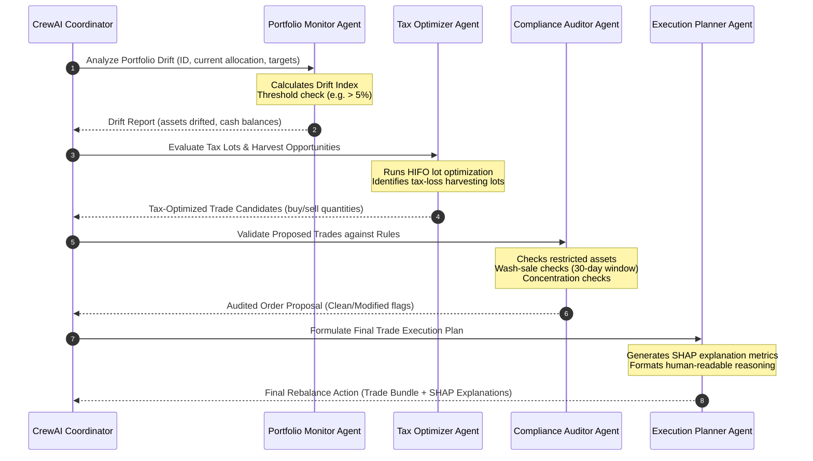
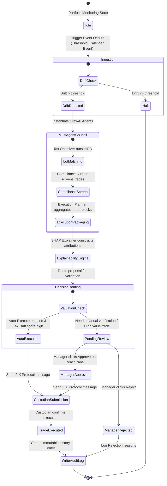
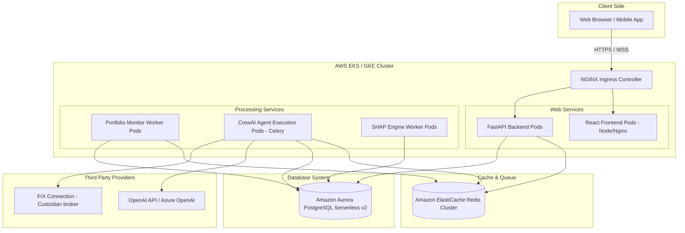

# WealthPilot AI - Autonomous Portfolio Rebalancing Agent
## Enterprise Architecture Specification

This document provides the formal architecture specification for the Autonomous Portfolio Rebalancing Agent at **WealthPilot AI**. The system is engineered to manage **50,000+ client portfolios** across **5 risk categories**, executing real-time drift monitoring, automated multi-trigger rebalancing, tax-loss harvesting, compliance checking, explainable AI explanations (using SHAP), and human-in-the-loop overrides.

---

## 1. System Architecture

The WealthPilot AI platform uses a decoupled microservices architecture leveraging a real-time event broker, an asynchronous job execution engine, a relational database cluster, and LLM-driven autonomous agents.

### High-Level Architecture Diagram
```mermaid
graph TB
    subgraph Frontend_Layer [Presentation Layer]
        ReactUI[React SPA - Dashboard & Queue]
        WebSockets[WebSockets / SSE Receiver]
    end

    subgraph API_Layer [API Gateway & Core]
        FastAPI[FastAPI Core Server]
        AuthEngine[OAuth2 & IAM Service]
    end

    subgraph Broker_Layer [Message & Event Broker]
        Redis[(Redis Event Cache)]
        Celery[Celery Task Queue]
    end

    subgraph Data_Layer [Data & Storage]
        PostgreSQL[(PostgreSQL Cluster)]
        AuditStore[(Partitioned Audit Trail)]
    end

    subgraph Agent_Layer [Agentic AI Execution Engine - CrewAI & LangChain]
        CrewOrch[CrewAI Agent Coordinator]
        DriftAgent[Portfolio Monitor Agent]
        TaxAgent[Tax Optimizer Agent]
        ComplianceAgent[Compliance Auditor Agent]
        ExecAgent[Execution Planner Agent]
        LLM[LLM Gateway - Claude / GPT]
    end

    subgraph Explainability_Service [Explainable AI]
        SHAPEngine[SHAP Explainer Service]
    end

    subgraph Integrations [External Services]
        Custodians[Custodian API - Trade Execution]
        MarketData[Market Data Provider - Real-time Feeds]
    end

    %% Flow lines
    ReactUI -->|REST API Requests| FastAPI
    WebSockets <--|Real-time Monitors| Redis
    FastAPI -->|Enqueue Jobs| Celery
    Celery -->|Triggers Agents| CrewOrch
    CrewOrch --> DriftAgent
    CrewOrch --> TaxAgent
    CrewOrch --> ComplianceAgent
    CrewOrch --> ExecAgent
    DriftAgent & TaxAgent & ComplianceAgent & ExecAgent -->|LLM Reasoning| LLM
    ExecAgent -->|Explains Decision| SHAPEngine
    SHAPEngine -->|Generates SHAP values| ExecAgent
    FastAPI -->|Read/Write| PostgreSQL
    Celery -->|Read/Write| PostgreSQL
    Celery -->|Log Events| AuditStore
    ExecAgent -->|Execute Orders| Custodians
    MarketData -->|Stream Prices| Redis
    Redis -->|Trigger Threshold Check| Celery
```

### Component Descriptions
- **React SPA**: The administrative control center where portfolio managers view real-time drifts, review explanation metrics (SHAP), and approve/reject pending orders.
- **FastAPI Core**: High-performance API server. Utilizes asynchronous features of Python to handle WebSocket connections and route REST requests.
- **Redis Event Cache & Queue**: Serves as the transient datastore for real-time market feeds, Celery broker, and WebSocket session states.
- **Celery Task Queue**: Handles concurrent asynchronous workloads, including scheduled portfolio evaluations and background agent execution.
- **PostgreSQL**: Structured database for transactional, portfolio, tax lot, and configuration storage.
- **CrewAI & LangChain**: A multi-agent framework where specialized LLM-backed roles evaluate candidate rebalances, resolve tax consequences, and enforce regulatory constraints.
- **SHAP Explainer Service**: Uses tree-based game-theoretic models to attribute rebalancing triggers to specific factors (e.g. drift magnitude, asset classes, tax gains, current market index volatility).

---

## 2. Agent Architecture

The heart of the autonomous system is the **CrewAI Multi-Agent System**, powered by **LangChain** and wrapped in custom Python agents. This layer does not rely on single linear prompts; instead, it establishes an autonomous council of agents with clear responsibilities, collaborative interfaces, and strict tool permissions.



### Agent Roles & Specifications

| Agent Name | LLM Profile | Key Responsibilities | Custom Tools (LangChain) |
| :--- | :--- | :--- | :--- |
| **Portfolio Monitor Agent** | GPT-4o-mini / Claude 3.5 Sonnet | Computes portfolio drifts, classifies trigger type (threshold vs. calendar vs. event), checks overall portfolio health. | `drift_calculator_tool`, `get_portfolio_allocations` |
| **Tax Optimizer Agent** | GPT-4o / Claude 3.5 Sonnet | Applies HIFO (Highest In, First Out) rules, runs Tax-Loss Harvesting (TLH), avoids short-term capital gains tax where possible. | `tax_lot_selector`, `harvest_opportunity_finder` |
| **Compliance Auditor Agent** | GPT-4o-mini / Claude 3.5 Sonnet | Enforces SEC/FINRA wash sale rule, restricted lists, customer maximum concentration limits (e.g. no single stock > 20% of net asset value). | `wash_sale_checker`, `restricted_list_validator` |
| **Execution Planner Agent** | GPT-4o / Claude 3.5 Sonnet | Packages execution bundles, compiles SHAP game-theoretic factors, structures explanations, submits orders to the database queue. | `shap_explanation_generator`, `broker_fee_estimator` |

---

## 3. Database Design

To manage 50,000 portfolios, real-time prices, tax lots, and compliance audit histories, the database schema is highly optimized in PostgreSQL.

### Entity-Relationship Diagram (ERD)
```mermaid
erDiagram
    RISK_CATEGORY ||--o{ PORTFOLIO : "classifies"
    PORTFOLIO ||--o{ PORTFOLIO_HOLDING : "contains"
    PORTFOLIO ||--o{ TAX_LOT : "tracks tax lots for"
    PORTFOLIO ||--o{ REBALANCE_PROPOSAL : "requests"
    PORTFOLIO ||--o{ AUDIT_LOG : "audits"
    REBALANCE_PROPOSAL ||--o{ PROPOSED_TRADE : "specifies"
    PORTFOLIO_HOLDING }|--|| ASSET : "represents"
    TAX_LOT }|--|| ASSET : "points to"
    PROPOSED_TRADE }|--|| ASSET : "targets"

    RISK_CATEGORY {
        int id PK
        string name "Conservative, Growth, etc"
        jsonb target_allocation "Asset target percentages"
    }

    PORTFOLIO {
        uuid id PK
        string account_number UNIQUE
        string client_name
        int risk_category_id FK
        numeric current_value
        numeric cash_balance
        timestamp last_rebalanced
        boolean auto_rebalance
    }

    ASSET {
        string symbol PK
        string name
        string asset_class "Equity, Fixed Income, Cash"
        numeric current_price
    }

    PORTFOLIO_HOLDING {
        uuid id PK
        uuid portfolio_id FK
        string asset_symbol FK
        numeric shares
        numeric market_value
    }

    TAX_LOT {
        uuid id PK
        uuid portfolio_id FK
        string asset_symbol FK
        numeric shares
        numeric purchase_price
        timestamp purchase_date
        boolean is_harvested
    }

    REBALANCE_PROPOSAL {
        uuid id PK
        uuid portfolio_id FK
        string trigger_type "Threshold, Calendar, Event"
        string status "Pending, Approved, Rejected, Executed"
        string reason
        jsonb shap_explanations "Explainability feature attributions"
        timestamp created_at
        uuid reviewer_id
    }

    PROPOSED_TRADE {
        uuid id PK
        uuid proposal_id FK
        string asset_symbol FK
        string action "BUY / SELL"
        numeric shares
        numeric estimated_price
        numeric tax_impact
    }

    AUDIT_LOG {
        uuid id PK
        uuid portfolio_id FK
        string event_type "Trigger, AgentRun, OrderApproval, OrderExecution"
        string details TEXT
        jsonb state_before
        jsonb state_after
        timestamp timestamp PK "Partition Key"
    }
```

### PostgreSQL Indexing & Optimization Strategy
1. **Holding Access**: Unique index on `portfolio_holdings(portfolio_id, asset_symbol)` ensures O(1) searches during allocation drift checks.
2. **Tax Lot Matching**: Index on `tax_lots(portfolio_id, asset_symbol, purchase_price)` enables the Tax Optimizer to quickly query and match lots under HIFO optimization.
3. **Partitioning**: The `audit_log` table is **Range-Partitioned** by `timestamp` monthly. This keeps active indexing tables small, preventing writes from degrading over time as audit records accumulate.
4. **JSONB Indexes**: GIN (Generalized Inverted Index) on `rebalance_proposal(shap_explanations)` permits query search on specific SHAP factors.

---

## 4. API Design (FastAPI)

FastAPI leverages Pydantic models for fast response serialization and automatic OpenAPI documentation.

### Core Endpoints

#### 1. Real-time Portfolio Health Dashboard
- **Endpoint**: `GET /api/v1/portfolios`
- **Query Params**:
  - `page`: integer (default 1)
  - `limit`: integer (default 50)
  - `risk_category`: string (optional)
  - `needs_rebalance`: boolean (optional)
- **Response**:
  ```json
  {
    "total": 50000,
    "page": 1,
    "limit": 50,
    "data": [
      {
        "id": "e4b3c75d-6e8a-4db3-9d10-8b63dc2c2c01",
        "account_number": "WP-000451",
        "client_name": "Sarah Connor",
        "risk_category": "Aggressive Growth",
        "total_value": 750000.00,
        "cash_balance": 15000.00,
        "current_drift": 0.062,
        "needs_rebalance": true,
        "last_rebalanced": "2026-04-12T14:32:00Z"
      }
    ]
  }
  ```

#### 2. Trigger Rebalance Assessment (Manual / API Trigger)
- **Endpoint**: `POST /api/v1/rebalance/trigger`
- **Request Body**:
  ```json
  {
    "trigger_type": "Event",
    "description": "Fed Rate Cut Market Adjustment",
    "portfolio_ids": ["e4b3c75d-6e8a-4db3-9d10-8b63dc2c2c01"]
  }
  ```
- **Response**:
  ```json
  {
    "task_id": "job_883c7de2-3392",
    "status": "QUEUED",
    "message": "Rebalancing assessment queued for 1 portfolios."
  }
  ```

#### 3. Pending Approval Queue (Human Override)
- **Endpoint**: `GET /api/v1/rebalance/queue`
- **Response**:
  ```json
  [
    {
      "proposal_id": "prop_991f8c32",
      "portfolio_id": "e4b3c75d-6e8a-4db3-9d10-8b63dc2c2c01",
      "account_number": "WP-000451",
      "client_name": "Sarah Connor",
      "trigger_type": "Threshold",
      "reason": "Equity drift exceeded threshold (+6.2%)",
      "created_at": "2026-06-08T22:20:00Z",
      "proposed_trades": [
        {"symbol": "SPY", "action": "SELL", "shares": 120, "estimated_price": 510.50, "tax_impact": 120.00},
        {"symbol": "AGG", "action": "BUY", "shares": 560, "estimated_price": 108.20, "tax_impact": 0.00}
      ],
      "shap_explanations": {
        "drift_magnitude": 0.45,
        "tax_savings_potential": 0.35,
        "transaction_fees": -0.10,
        "market_volatility": 0.20,
        "wash_sale_risk": -0.05
      }
    }
  ]
  ```

#### 4. Approve / Reject Rebalance
- **Endpoint**: `POST /api/v1/rebalance/{proposal_id}/action`
- **Request Body**:
  ```json
  {
    "action": "APPROVED", // or "REJECTED"
    "comments": "Tax harvesting looks optimal. Executing trade."
  }
  ```
- **Response**:
  ```json
  {
    "proposal_id": "prop_991f8c32",
    "status": "APPROVED",
    "executed_at": "2026-06-08T22:23:45Z",
    "audit_log_id": "audit_882c7d9a"
  }
  ```

---

## 5. Workflow Diagram (Rebalancing Lifecycle)

The lifecycle of a portfolio rebalancing operation follows a rigid processing workflow enforcing auditability and validation.



---

## 6. Deployment Architecture

The production environment runs inside a container orchestration platform (Kubernetes) mapped to cloud provider resources to support horizontal scaling for high-load operations.



### Infrastructure Configuration Details

1. **Auto-Scaling Policy**: 
   - Backend API pods scale on CPU utilization (threshold 70%).
   - Celery Agent Execution pods scale based on length of the Celery Redis queue (e.g. scale up when queue depth > 500 tasks) using KEDA (Kubernetes Event-driven Autoscaling).
2. **Broker Throughput (Redis)**:
   - Configured with clustering enabled to process up to 100,000 real-time price updates per second during high volatility events.
3. **Database HA**:
   - PostgreSQL runs on multi-AZ Amazon Aurora Serverless v2. Master node handles updates from worker pods, read-replicas offload dashboard queries for the frontend client.
4. **Security & Governance**:
   - All REST and WebSocket traffic is protected with TLS 1.3.
   - Database credentials and API keys (e.g. OpenAI keys) are injected at runtime via Kubernetes Secrets synced with AWS Secrets Manager.
   - Compliance logs are stored in PostgreSQL tables that enforce write-once-read-many (WORM) constraints at the database level to ensure immutability.
